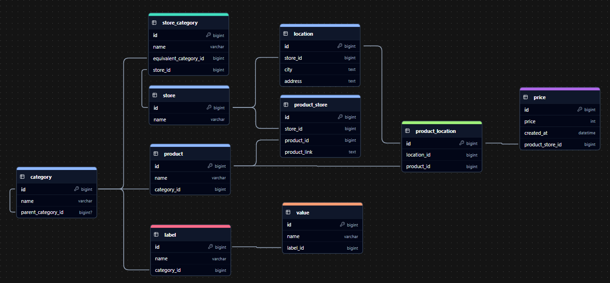

# PravaCijena API Documentation

## Description
API for retriving, organizing and collecting products and their prices.

## Table of Contents
- ### [API Endpoints](#api-endpoints)
- #### [Regular API Endpoints (ID-based)](#regular-api-endpoints-id-based)
- [Category Endpoints](#category-endpoints)
- [Label Endpoints](#label-endpoints)
- [Product Endpoints](#product-endpoints)
- [Store Endpoints](#store-endpoints)
- [ProductStore Endpoints](#productstore-endpoints)
- [Price Endpoints](#price-endpoints)
- [Value Endpoints](#value-endpoints)
- [Automation Endpoints](#automation-endpoints)
- #### [Slug Endpoints](#slug-endpoints)
- [Category Slug Endpoints](#category-slug-endpoints)
- [Label Slug Endpoints](#label-slug-endpoints)
- [Product Slug Endpoints](#product-slug-endpoints)
- [Store Slug Endpoints](#store-slug-endpoints)
- ### [Database Structure](#database-structure)
- ### [Starting locally](#starting-locally)
- [Prerequisites](#prerequisites)
- [How to start](#how-to-start)

## Api Endpoints

### Regular API Endpoints (ID-based)

#### Category Endpoints

| Method | Endpoint | Description | Parameters
|-----|-----|-----|-----
| GET | `/api/categories` | Get all categories | None
| GET | `/api/categories/{categoryId:guid}` | Get category by ID | `categoryId` (GUID)
| POST | `/api/categories` | Create a new category | `CreateCategoryRequestDto` (body)
| PATCH | `/api/categories/{categoryId:guid}` | Update a category | `categoryId` (GUID), `UpdateCategoryRequestDto` (body)
| DELETE | `/api/categories/{categoryId:guid}` | Delete a category | `categoryId` (GUID)


#### Label Endpoints

| Method | Endpoint | Description | Parameters
|-----|-----|-----|-----
| GET | `/api/categories/{categoryId:guid}/labels` | Get all labels for a category | `categoryId` (GUID)
| GET | `/api/categories/{categoryId:guid}/labels/{labelId:guid}` | Get label by ID | `categoryId` (GUID), `labelId` (GUID)
| POST | `/api/categories/{categoryId:guid}/labels` | Create a new label | `categoryId` (GUID), `CreateLabelRequestDto` (body)
| PATCH | `/api/categories/{categoryId:guid}/labels/{labelId:guid}` | Update a label | `categoryId` (GUID), `labelId` (GUID), `UpdateLabelRequestDto` (body)
| DELETE | `/api/categories/{categoryId:guid}/labels/{labelId:guid}` | Delete a label | `categoryId` (GUID), `labelId` (GUID)


#### Product Endpoints

| Method | Endpoint | Description | Parameters
|-----|-----|-----|-----
| GET | `/api/categories/{categoryId:guid}/products` | Get all products for a category | `categoryId` (GUID), `QueryObject` (query)
| GET | `/api/categories/{categoryId:guid}/products/{productId:guid}` | Get product by ID | `categoryId` (GUID), `productId` (GUID)
| POST | `/api/categories/{categoryId:guid}/products` | Create a new product | `categoryId` (GUID), `CreateProductRequestDto` (body)
| PATCH | `/api/categories/{categoryId:guid}/products/{productId:guid}` | Update a product | `categoryId` (GUID), `productId` (GUID), `UpdateProductRequestDto` (body)
| DELETE | `/api/categories/{categoryId:guid}/products/{productId:guid}` | Delete a product | `categoryId` (GUID), `productId` (GUID)


#### Store Endpoints

| Method | Endpoint | Description | Parameters
|-----|-----|-----|-----
| GET | `/api/stores` | Get all stores | None
| GET | `/api/stores/{storeId:guid}` | Get store by ID | `storeId` (GUID)
| POST | `/api/stores` | Create a new store | `CreateStoreRequestDto` (body)
| PATCH | `/api/stores/{storeId:guid}` | Update a store | `storeId` (GUID), `UpdateStoreRequestDto` (body)
| DELETE | `/api/stores/{storeId:guid}` | Delete a store | `storeId` (GUID)


#### ProductStore Endpoints

| Method | Endpoint | Description | Parameters
|-----|-----|-----|-----
| GET | `/api/product-stores/{productId:guid}` | Get all stores for a product | `productId` (GUID)
| GET | `/api/product-stores/{productId:guid}/{storeId:guid}` | Get product-store relationship | `productId` (GUID), `storeId` (GUID)
| POST | `/api/product-stores` | Create a new product-store relationship | `CreateProductStoreRequestDto` (body)
| PATCH | `/api/product-stores/{productId:guid}/{storeId:guid}` | Update a product-store relationship | `productId` (GUID), `storeId` (GUID), `UpdateProductStoreRequestDto` (body)
| DELETE | `/api/product-stores/{productId:guid}/{storeId:guid}` | Delete a product-store relationship | `productId` (GUID), `storeId` (GUID)


#### Price Endpoints

| Method | Endpoint | Description | Parameters
|-----|-----|-----|-----
| GET | `/api/product-stores/{productStoreId:guid}/prices` | Get all prices for a product-store | `productStoreId` (GUID)
| GET | `/api/product-stores/{productStoreId:guid}/prices/{priceId:guid}` | Get price by ID | `productStoreId` (GUID), `priceId` (GUID)
| POST | `/api/product-stores/{productStoreId:guid}/prices` | Create a new price | `productStoreId` (GUID), `CreatePriceRequestDto` (body)


#### Value Endpoints

| Method | Endpoint | Description | Parameters
|-----|-----|-----|-----
| GET | `/attributes/{attributeId:guid}/values` | Get all values for an attribute | `attributeId` (GUID)
| GET | `/attributes/{attributeId:guid}/values/{valueId:guid}` | Get value by ID | `attributeId` (GUID), `valueId` (GUID)
| POST | `/attributes/{attributeId:guid}/values` | Create a new value | `attributeId` (GUID), `CreateValueRequestDto` (body)
| PATCH | `/attributes/{attributeId:guid}/values/{valueId:guid}` | Update a value | `attributeId` (GUID), `valueId` (GUID), `UpdateValueRequestDto` (body)
| DELETE | `/attributes/{attributeId:guid}/values/{valueId:guid}` | Delete a value | `attributeId` (GUID), `valueId` (GUID)


#### Automation Endpoints

| Method | Endpoint | Description | Parameters
|-----|-----|-----|-----
| POST | `/api/automation/scrape` | Run the scraper | None
| POST | `/api/automation/analyze-catalogue` | Analyze PDF catalogues | `pdfFile` (optional form file)


### Slug Endpoints

#### Category Slug Endpoints

| Method | Endpoint | Description | Parameters
|-----|-----|-----|-----
| GET | `/api/categories/{categorySlug}` | Get category by slug with subcategories | `categorySlug` (string)


#### Label Slug Endpoints

| Method | Endpoint | Description | Parameters
|-----|-----|-----|-----
| GET | `/api/categories/{categorySlug}/labels` | Get all labels for a category by slug | `categorySlug` (string)
| GET | `/api/labels/{labelSlug}` | Get label by slug | `labelSlug` (string)


#### Product Slug Endpoints

| Method | Endpoint | Description | Parameters
|-----|-----|-----|-----
| GET | `/api/categories/{categorySlug}/products` | Get all products for a category by slug | `categorySlug` (string), `QueryObject` (query)
| GET | `/api/products/{productSlug}` | Get product by slug | `productSlug` (string)
| GET | `/api/products/search` | Search for products | `searchTerm` (query)


#### Store Slug Endpoints

| Method | Endpoint | Description | Parameters
|-----|-----|-----|-----
| GET | `/api/stores/{storeSlug}` | Get store by slug | `storeSlug` (string)

## Database Structure
Database consists of 8 tables connected in following way shown by an image:


## Starting locally

### Prerequisites

Ensure you have the following installed:

-   .NET 9.0+
-   PostgreSQL
-   Git

### How to start
1. Clone repository:
```
git clone git@github.com:Ivo-Kovacevic/prava-cijena-api.git
```

2. Navigate into directory:
```
cd prava-cijena-api
```

3. Install .NET dependencies:
```
dotnet restore
```

4. Make PostgreSQL database called `prava_cijena`:
```
CREATE DATABASE prava_cijena;
```

5. Setup `.env` file:
```
DB_CONNECTION=USE_YOUR_DATABASE_CONNECTION_STRING_HERE
GEMINI_API_KEY=USE_YOUR_DATABASE_GEMINI_API_KEY_HERE
```

6. Make database tables and then seed them:

```
dotnet ef migrations add Init
```
```
dotnet ef database update
```

7. Start API with:
```
dotnet run
```
or
```
dotnet run --launch-profile https
```